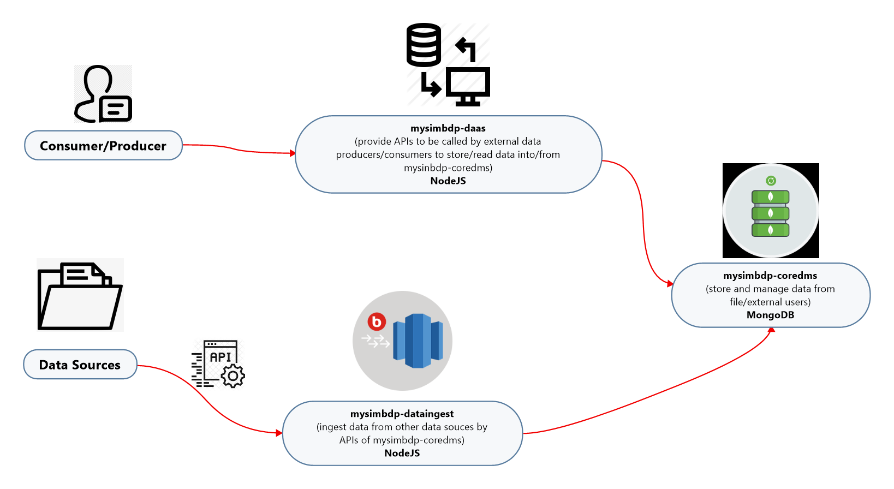
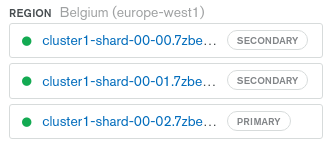
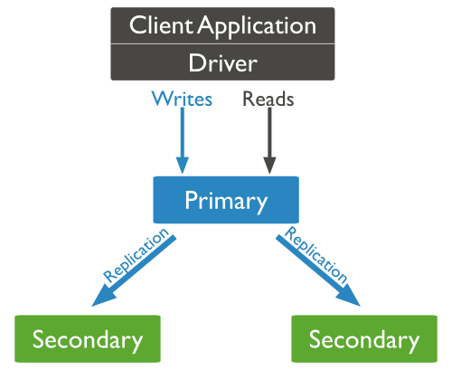
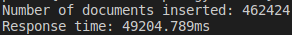
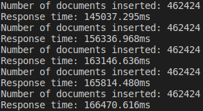

# First Assignment - Building Your Big Data Platforms

## Part 1 - Design

#### 1. Explain your choice of data and technologies for mysimbdp-coredms (1 point)
   * In order to practice data ingestion, I tried to obtain datasets from three different kinds of sources:
   1. GCP BigQuery: [bigquery-public-data.covid19_public_forecasts](https://console.cloud.google.com/marketplace/product/bigquery-public-datasets/covid19-public-forecasts?project=optimum-lodge-302214&folder=&organizationId=) (note: it somehow failed to fetch the dataset from GCP but I'll try again after assignment1 is almost down)
   2. From JSON APIs: [COVID-19 Coronavirus data - daily (up to 14 December 2020)](https://opendata.ecdc.europa.eu/covid19/casedistribution/json)
   3. From local file: [BTS data](https://version.aalto.fi/gitlab/bigdataplatforms/cs-e4640/-/blob/master/data/bts/README.md)
   These datasets are not too big for the mysimbdp-coredms, which currently has max size of 512Mb.
   * I chose MongoDB as mysimbdp-coredms and NodeJS to do the data ingestion/read/write.
   1. MongoDB's document-oriented data model makes it exceptionally easy and fast to add or change fields, among other things.
   2. MongoDB’s horizontal, scale-out architecture can support huge volumes of both data and traffic.
   3. MongoDB has developed a large and mature platform ecosystem: it has a worldwide community of developers and consultants, so it is easy to get help; it works on all types of computing platforms, both on-premise and in the cloud and can be used from all major languages.
   4. I have been recently working with Javascript and it is a good chance for me to practice NodeJS through this assignment. And there are many corresponding APIs that can be used to fulfull the requirements.

#### 2. Design and explain interactions between main components in your architecture of mysimbdp (1 point)
   ---
   
   * Fig 1: Workflow/Architecture of the application
   ---
   * mysimbdp-dataingest fetches data from external data sources and uses MongoDB APIs to ingest data into mysimbdp-coredms.
   * mysimbdp-coredms is the platform where the data are stored and managed.
   * mysimbdp-daas will provide APIs to external data producers/comsumers to store/read data into/from mysinbdp-coredms

#### 3. Explain a configuration of a cluster of nodes for mysimbdp-coredms so that you do not have a single-point-of-failure problem for mysimbdp-coredms for your tenants (1 point)
* ##### Cluster Running Approach (Multi-active mode)
  Multiple master nodes work together, each running one or several services, and each defining one or more backup nodes for the services. When any master node fails, the master nodes takes over the services that were running on it.


#### 4. You decide a pre-defined level of data replication for your tenants/customers. Explain how many nodes are needed in the deployment of mysimbdp-coredms for your choice so that this component can work property (e.g., the system still supports redundancy in the case of a failure of a node) (1 point)
* For a proper production MongoDB setup with clustering, MongoDB Inc. suggests:
  * At least 2 mongos routers
  * Exactly 3 config servers
  * 3 servers per shard (primary, secondary and arbiter), where the arbiters do not necessarily need dedicated servers and can share hardware with the routers, config servers, members of a different replica-set or app servers.
* Distributing replica set members across two data centers provides benefit over a single data center. In a two data center distribution,
  * If one of the data centers goes down, the data is still available for reads unlike a single data center distribution.
  * If the data center with a minority of the members goes down, the replica set can still serve write operations as well as read operations.


#### 5. Explain how would you scale mysimbdp to allow many tenants using mysimbdp-dataingest to push data into mysimbdp(1 point)
   * Currently, mysimbdp-coredms uses the free plan of MongoDB Atlas, which support 512Mb data storage. And if it is needed, it is of course better to upgrade the plan to have bigger storage when you have multiple data resources.


## Part 2 - Implementation

#### 1. Design, implement and explain the data schema/structure for mysimbdp-coredms (1 point)
* MongoDB Atlas was chosen and cloud provider & region was GCP, Belgium.
* Cluster Tier: M0 Sandbox (Shared RAM, 512 MB Storage)
* Database named 'mydb' was created and also multiple databases/collections could be created under the cluster1.

#### 2. Design a strategy for data partitioning/sharding and explain your implementation for data partitioning/sharding together with your design for replication in Part 1, Point 4, in mysimbdp-coredms (1 point)
* Three shards(nodes) are created under cluster1: one primary shard and two secondary shards.
* The replica set is a set of MongoDB instances which share the same data content.
##### (a) Primary node
* The primary node receives all the write requests, and then synchronizes the changes to all the secondary nodes. A replica set can only have one primary node. When the primary fails, the other secondary nodes or the arbiter node will re-elect a primary node. The primary node receives read requests for processing by default. If you want to forward the read requests to a secondary node, you need to modify the connection configuration on the client.
##### (b) Secondary nodes
* The secondary node maintains the same data set with the primary node. When the primary node fails, the secondary nodes participate in the election of a new primary node.
##### (c) Arbiter nodes
* An arbiter node does not store data or participate in the primary node election, but it performs election voting. The arbiter node can reduce the hardware requirements for data storage, as the arbiter runs with minimal demand on hardware resources. However, it is important that one should not deploy the arbiter node on the same server with other data nodes in the production environment.

---

* Fig 2: Sharding strategy


* Fig 3: Replica set with the primary and secondary nodes
---

#### 3. Write a mysimbdp-dataingest that takes data from your selected sources and stores the data into mysimbdp-coredms. Explain possible consistency options for writing data in your mysimdbp-dataingest (1 point)
* MongoDB is consistent by default: reads and writes are issued to the primary member of a replica set. Applications can optionally read from secondary replicas, where data is eventually consistent by default. Reads from secondaries can be useful in scenarios where it is acceptable for data to be slightly out of date, such as some reporting applications. Applications can also read from the closest copy of the data (as measured by ping distance) when latency is more important than consistency.
* Number of Replicas to Write: Specifying the number of replicas to write to in a query allows a system to trade-off write query performance and consistency for each use case. In MongoDB, this capability is specified in the client.
* Durable Writes: Durable write operations ensure that if the database fails after a write operation has completed, the effects of the write are guaranteed to be visible upon recovery. Databases that support ACID transactions will always provide durable writes. In MongoDB, durable writes are supported.

#### 4. Given your deployment environment, show the performance (response time and failure) of the tests for 1,5, 10, .., n of concurrent mysimbdp-dataingest writing data into mysimbdp-coredms with different speeds/velocities. Indicate any performance differences due to the choice of consistency options (1 point)

---

* Fig 4: 1 BTS dataset ingestion


* Fig 5: 5 concurrent BTS dataset ingestions
---
* Due to storage limitaion, it only support 5 concurrent ingestion for BTS dataset. As we can see, it took far more time when n=5 than n=1. 
* I also tested the COVID-19 forcast dataset for n=1,5,10,50, which had similar results.
* There were no error thrown during these data ingestion process.

#### 5. Observing the performance and failure problems when you push a lot of data into mysimbdp-coredms (you do not need to worry about duplicated data in mysimbdp), propose the change of your deployment to avoid such problems (or explain why you do not have any problem with your deployment) (1 point)
* The reason why there were no error thrown during data ingestion process may be that MongoDB allows multiple clients to read and write the same data. In order to ensure consistency, it uses locking and other concurrency control measures to prevent multiple clients from modifying the same piece of data simultaneously. Together, these mechanisms guarantee that all writes to a single document occur either in full or not at all and that clients never see an inconsistent view of the data.


## Part 3 - Extention

#### 1. Using your mysimdbp-coredms, a single tenant can create many different databases/datasets. Assume that you want to support the tenant to manage metadata about the databases/datasets, what would be your solution? (1 point)
* In this case we could go for two possible solutions:
1. using flexibility of dynamic schema create a meta doc with _id="meta", and store there all requred data
2. create meta collection and in each document store info about collection, e.g. _id="collection name"
```
db.createCollection(<name>, { capped: <boolean>,
                              autoIndexId: <boolean>,
                              size: <number>,
                              max: <number>,
                              storageEngine: <document>,
                              validator: <document>,
                              validationLevel: <string>,
                              validationAction: <string>,
                              indexOptionDefaults: <document> } )
```


#### 2. Assume that each of your tenants/users will need a dedicated mysimbdp-coredms. Design the data schema of service information for mysimbdp-coredms that can be published into an existing registry (like ZooKeeper, consul or etcd) so that you can find information about which mysimbdp-coredms is for which tenants/users (1 point)
* In this case, the data schema could be designed as follows:
  * id: The id of the tenant.
  * name: The name of the service.
  * description: A description of the service.
  * image: An image of the service. This can be a URL or a fully described ImageObject.
  * logo: An associated logo. You may want to just leave this blank and refer to the Organization and its logo. 
  * potentialAction: Indicates a potential Action, which describes an idealized action in which this thing would play an ‘object’ role. For example: “write data” or “request data”.
  * provider: The service provider, service operator, or service performer. This is a great way to link to the primary organization offering the service. 
  * serviceOutput: The tangible thing generated by the service.
  * termsOfService: Human-readable terms of service documentation in the form of either text or a URL.

#### 3. Explain how you would change the implementation of mysimbdp-dataingest (in Part 2) to integrate a service discovery feature (no implementation is required) (1 point)
* In this case, it would be useful to add service discovery component to mysimbdp-dataingest. For example, Consul can provide end-to-end service discovery as well as health check for the process. And there are simple APIs provided by Consul for NodeJS so it would be convenient to implement.

#### 4. Assume that now only mysimbdp-daas can read and write data into mysimbdp-coredms, how would you change your mysimbdp-dataingest (in Part 2) to work with mysimbdp-daas? (1 point)
* Join mysimbdp-dataingest and mysimbdp-daas together to provide both services for data ingestion and allow exernal consumer/producer to access the mysimbdp-coredms.

#### 5. Assume that you design APIs for mysimbdp-daas so that any other developer who wants to implement mysimbdp-dataingest can write his/her own ingestion program to write the data into mysimbdp-coredms by calling mysimbdp-daas. Explain how would you control the data volume and speed in writing and reading operations for a tenant? (1 point)
* Add caching to return data from the local memory cache instead of querying the database to get the data every time we want to retrieve some data that users request.
* Giving the consumer full control will improve API performance by reducing the weight of the data returned, thanks to very specific requests for data fields. It may also minimize the number of requests, if the consumer or application is able to get all required data in one go. 
* Set limitaions to how many queries to receive in a second/minute/hour from a normal user/how much data could a single request to return/


